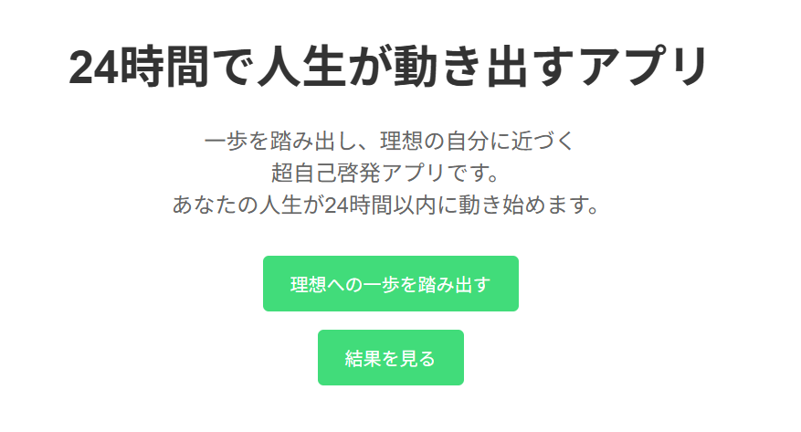
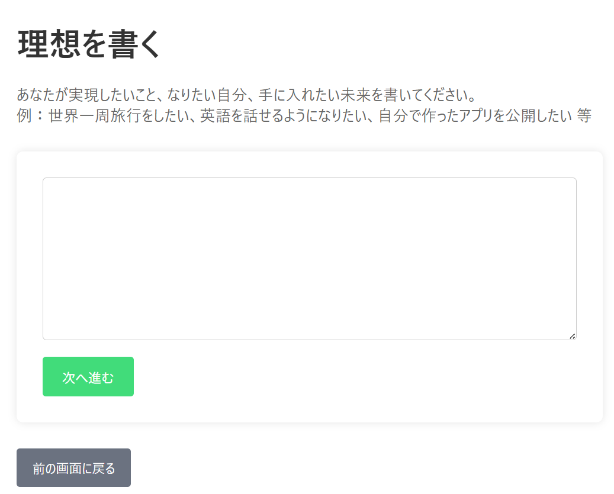
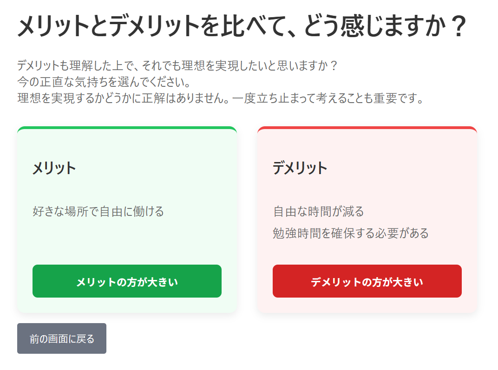
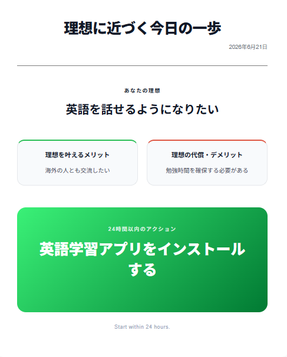

# 24時間で人生が動き出すアプリ

## アプリ概要

理想を実現するために、24時間以内に実行できる行動を考え、最初の一歩を踏み出すための自己啓発アプリです。

理想を考えるだけで終わらせず、「今すぐできる行動」まで落とし込むことで、行動につながる仕組みを目指しました。

- 公開URL:
https://do-within-24.onrender.com/

## 開発背景

私は、実現したい理想や目標を考えることはあっても、具体的な行動まで落とし込めずに終わってしまうことがありました。

そこで、

* 理想を言語化する
* 理想を叶えるメリット・デメリットを整理する
* 24時間以内に実行できる行動を決める

という流れを、1つのフォーマットとしてアプリ上で完結できるようにしました。

また、Reactを用いたアプリ開発を通して、コンポーネント設計や状態管理への理解を深めることも目的として制作しました。

## 想定ユーザー

* やりたいことがあるが最初の一歩が踏み出せない人
* 理想を考えるだけで終わってしまう人
* 自己分析や目標設定が好きな人
* 行動習慣を身につけたい人

## 機能一覧

### 理想の整理機能

以下の内容を入力し、画面上で整理できます。

* 理想
* 理想を叶えることで得られるもの
* 理想を叶えることで失うもの
* 24時間以内に実施できる行動

### メリット・デメリット比較機能

理想を叶えることで得られるものと失うものを比較し、行動する価値を整理できます。

### 結果画面の画像保存機能

入力内容を画像として保存できます。

保存した画像は、振り返り、SNS共有などに活用できます。

---

## 画面イメージ

### トップ画面

### 入力画面

### メリット・デメリット比較画面

### 結果画面

---

## 技術スタック

### フロントエンド

* React
* Vite
* TypeScript
* HTML
* CSS

### 開発環境

* Docker
* Git
* GitHub

### デプロイ

* Render

---

## 工夫したポイント

### 1. 行動にフォーカスした設計

理想を考えるだけで終わらせず、「24時間以内に実行できる行動」を考える構成にしました。行動のハードルを下げることで、理想と現実の距離を縮めることを目指しています。

### 2. シンプルなUI

入力項目を必要最低限に絞り、誰でも短時間で利用できるようにしました。複雑な機能を追加せず、「考えること」と「行動すること」に集中できる設計を意識しています。

### 3. 画像として保存できる仕組み

入力した内容を画像として保存できるようにしました。目標を可視化して残せるため、後から振り返りやすくなっています。

## 学んだこと

本アプリの開発を通じて、

* Reactのコンポーネント設計
* useStateを用いた状態管理
* TypeScriptによる型定義
* 画像保存機能の実装

について理解を深めることができました。
